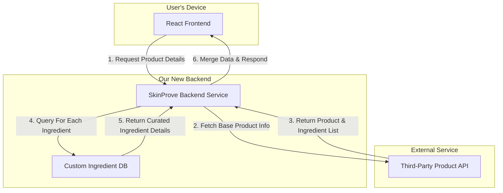

# SkinProve Ingredient Data - Architectural Plan

This document outlines the architecture for a hybrid data solution to provide detailed ingredient information for skincare products within the SkinProve application.

## 1. Core Concept

The system will combine data from two primary sources:
1.  A **Third-Party Product API** (e.g., Amazon Product Advertising API, a retailer's API) to fetch basic product information and raw ingredient lists.
2.  A **Custom Internal Database** that we will build and curate. This database will store detailed, user-friendly information about individual skincare ingredients.

A new **SkinProve Backend Service** will orchestrate the data flow, acting as an intermediary between the front-end application and these two data sources.

## 2. System Components

### A. SkinProve React Frontend
*   **Responsibility**: Displays product and ingredient information to the user.
*   **Interaction**: When a user wants to view product details, the frontend will make a single API call to our new SkinProve Backend Service, requesting the product by its ID or name. It will no longer use the static `products.ts` file for this.

### B. SkinProve Backend Service (New)
*   **Technology**: We can build this with a technology like Node.js and Express, which is a common choice for React applications.
*   **Responsibilities**:
    1.  Expose API endpoints for the frontend (e.g., `/api/products/:id`).
    2.  Receive requests from the frontend.
    3.  First, attempt to fetch product data from the Third-Party Product API.
    4.  Parse the raw ingredient list from the third-party response.
    5.  For each ingredient in the list, query our **Custom Ingredient DB** to get our curated, user-friendly data (e.g., description, function, rating).
    6.  Merge the data from both sources into a single, structured JSON object.
    7.  Return this complete object to the React frontend.

### C. Third-Party Product API
*   **Responsibility**: Provides a scalable way to access a massive catalog of real-world products.
*   **Data Provided**: Product Name, Brand, Image URL, Price, and a raw (unstructured) list of ingredients.
*   **Example**: Amazon Product Advertising API.

### D. Custom Ingredient Database (New)
*   **Technology**: A simple relational database like PostgreSQL or a NoSQL database like MongoDB would be suitable.
*   **Responsibilities**: Store curated information about individual ingredients.
*   **Schema (Example for one ingredient)**:
    *   `ingredient_name`: "Hyaluronic Acid" (Primary Key)
    *   `function`: "Humectant"
    *   `description`: "A substance that attracts and retains moisture, helping to hydrate the skin and reduce the appearance of fine lines."
    *   `tags`: `['hydration', 'plumping', 'beginner-friendly']`

## 3. Data Flow Diagram

This diagram shows how a request for product information would flow through the system.

## 4. Implementation Steps

This architecture leads to the following development phases:

1.  **Backend Setup**: Initialize a new Node.js/Express project for the backend service.
2.  **Database Creation**: Set up the chosen database (e.g., PostgreSQL) and define the schema for our ingredients table. We can start populating it with a few common ingredients manually.
3.  **API Integration**: Sign up for a third-party product API and write the logic in our backend to fetch data from it.
4.  **Data Logic**: Implement the core logic in the backend service to parse and merge the data from the two sources.
5.  **Frontend Refactor**: Update the React components (e.g., `MyProducts.tsx`, `Shop.tsx`) to fetch data from our new backend API instead of the local mock file.